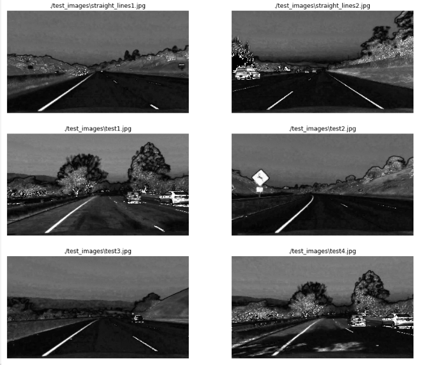

## Advanced Lane Finding
[](http://www.udacity.com/drive)


In this project, the goal was to write a software pipeline to identify the lane boundaries in a video.

The Project
---

The goals / steps of this project are the following:

* Compute the camera calibration matrix and distortion coefficients given a set of chessboard images.
* Apply a distortion correction to raw images.
* Use color transforms, gradients, etc., to create a thresholded binary image.
* Apply a perspective transform to rectify binary image ("birds-eye view").
* Detect lane pixels and fit to find the lane boundary.
* Determine the curvature of the lane and vehicle position with respect to center.
* Warp the detected lane boundaries back onto the original image.
* Output visual display of the lane boundaries and numerical estimation of lane curvature and vehicle position.

[//]: # (Image References)

[image1]: ./examples/undistort_output.png "Undistorted"
[image2]: ./test_images/test1.jpg "Road Transformed"
[image3]: ./examples/binary_combo_example.jpg "Binary Example"
[image4]: ./examples/warped_straight_lines.jpg "Warp Example"
[image5]: ./examples/color_fit_lines.jpg "Fit Visual"
[image6]: ./examples/example_output.jpg "Output"
[video1]: ./project_video.mp4 "Video"

## [Rubric](https://review.udacity.com/#!/rubrics/571/view) Points

### Here I will consider the rubric points individually and describe how I addressed each point in my implementation.  

---

### Camera Calibration

#### 1. This is a briefly state of how I computed the camera matrix and distortion coefficients. Provide an example of a distortion corrected calibration image

The camera calibration code for this step could be found on the [Step_1_Camera_Calibration notebook](Step_1_Camera_Calibration.ipynb).

I start by preparing "object points", which will be the (x, y, z) coordinates of the chessboard corners in the world. Here I am assuming the chessboard is fixed on the (x, y) plane at z=0, such that the object points are the same for each calibration image.  Thus, `objp` is just a replicated array of coordinates, and `objpoints` will be appended with a copy of it every time I successfully detect all chessboard corners in a test image.  `imgpoints` will be appended with the (x, y) pixel position of each of the corners in the image plane with each successful chessboard detection.  

I then used the output `objpoints` and `imgpoints` to compute the camera calibration and distortion coefficients using the `cv2.calibrateCamera()` function.  I applied this distortion correction to the test image using the `cv2.undistort()` function.

Using `cv2.findChessboardCorners`, the corners points are stored in an array `imgpoints` for each calibration image where the chessboard could be found. The object points will always be the same as the known coordinates of the chessboard with zero as 'z' coordinate because the chessboard is flat. The object points are stored in an array called `objpoints`. 

I then used the output objpoints and imgpoints to compute the camera calibration and distortion coefficients using the `cv2.calibrateCamera` function. I applied this distortion correction to the test image using the `cv2.undistort` function and obtained this result:


The camera calibration and distortion coefficients(mtx, dist) are stored using `pickle`(in folder ./pickled_data/camera_calibration.p) to be used on the main [notebook](Project.%20Advance%20Lane%20Lines.ipynb)

A short description of the images in [Step_1_Camera_Calibration notebook](Step_1_Camera_Calibration.ipynb) to compute the camera calibration matrix and distortion coefficients given a set of chessboard images:
```
readChessImages(): Load calibration images(chess boards in different angles from our camera_cal folder)
showImages(calibrationImages): Method for displaying the images
findingPoints(calibrationImages): Method for detecting the points in chess images (objpoints and imgpoints)
getCoefficients(objpoints, imgpoints, originalImage): Method for returning camera matrix, mtx, and the distortion coefficients dist

HOW TO USE THESE FUNCTIONS: 

# Read images
calibrationImages = readChessImages()
# Return object points and image points
objpoints, imgpoints, originalImages, outimages = findingPoints(calibrationImages)
# Save coefficients into pickle
originalImage = originalImages[10]

#Getting the coefficients we need for camera calibration
mtx,dist = getCoefficients(objpoints, imgpoints, originalImage)
```
### Pipeline (single images)
#### 1. Provide an example of a distortion-corrected image.
To demonstrate this step, I will describe how I apply the distortion correction to one of the test images like this one:


#### 2. Describe how (and identify where in your code) you used color transforms, gradients or other methods to create a thresholded binary image.  Provide an example of a binary image result.

The code used to experiment with color, gradients, and thresholds could be found on the [Step 2. Color Transform and Gradients Threshold notebook](Step_2_Color_Transform_and_Gradients_Threshold.ipynb).

A color transformation to HLS was done, and the S channel was selected because it shows more contracts on the lane lines. Here are the results for all the testing images:


## How to write a README
A well written README file can enhance your project and portfolio.  Develop your abilities to create professional README files by completing [this free course](https://www.udacity.com/course/writing-readmes--ud777).

